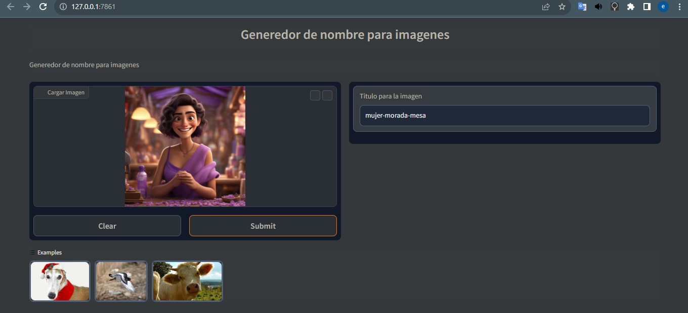

# Generador de Título para Imágenes

Este proyecto utiliza un modelo de generación de texto para generar títulos para imágenes. El modelo utilizado se accede a través de una API y requiere una clave de autorización.

## Instalación

1. Clona este repositorio en tu máquina local.
2. Instala las dependencias necesarias ejecutando el siguiente comando:

´´´bash
pip install -r requirements.txt
´´´

## Uso

1. Ejecuta el archivo `main.py` para lanzar la interfaz gráfica.
2. Haz clic en "Cargar Imagen" para seleccionar una imagen.
3. Haz clic en "Generar Título" para generar un título para la imagen cargada.
4. El título generado se mostrará en el cuadro de texto "Título para la imagen".

## Configuración

Antes de ejecutar el proyecto, asegúrate de configurar las siguientes variables:

- `API_KEY_OPENAI`: La clave de autorización para acceder a la API de OpenAI.
- `URL_MODEL`: La URL o endpoint del modelo de generación de texto.
- `API_HF`: La clave de autorización necesaria para acceder al modelo.

## Contribuciones

Si deseas contribuir a este proyecto, sigue los siguientes pasos:

1. Realiza un fork del repositorio.
2. Crea una nueva rama para tu contribución.
3. Realiza los cambios y realiza un commit.
4. Envía un pull request para revisar tu contribución.

## Licencia

Este proyecto se encuentra bajo la licencia [MIT](https://opensource.org/licenses/MIT).

